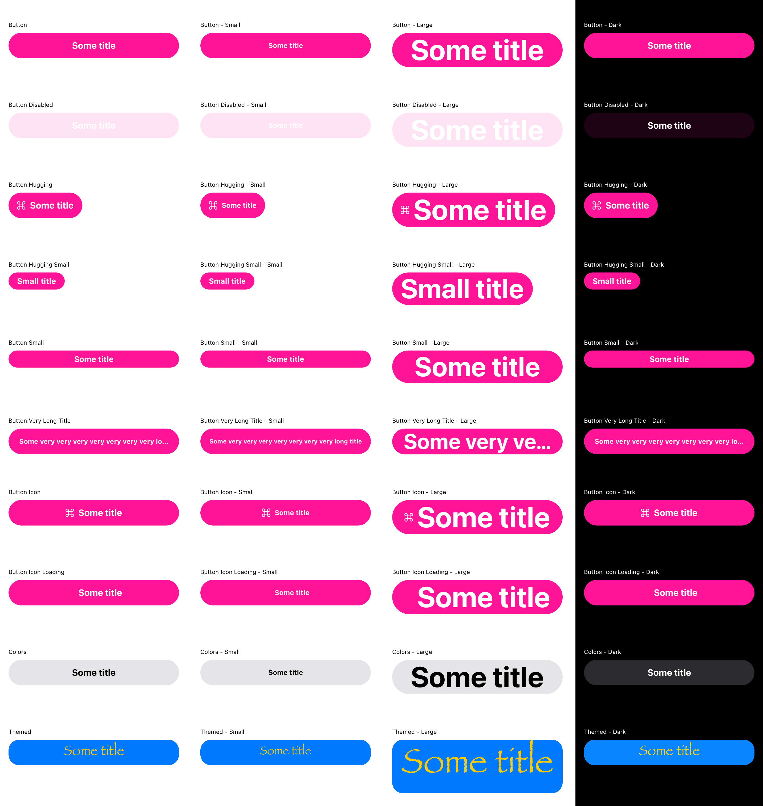

# Button component

## Preview
[See in Figma](https://www.figma.com/file/1P6PQxKaqIaLjxxfy1cFtH/MaaS-Design-System?node-id=410%3A0)

## Specifications
**Types:** Primary, Secondary.  
**Sizes:** Small, Normal, Large.  
**States:** Normal, Active, Disabled  
**Behaviour:** onTap changes state to “Active”. If interaction takes longer than 300ms changes state to “inProgress” [TBD].  

## Recommendations
- As a rule of thumb, there should be only one primary button per screen. If you need more actions, please consider secondary, and/or tertiary buttons.
- Keep text concise. Text longer than 22 symbols, might be truncated on smaller screens.

## API
[ButtonConstants.kt](ButtonConstants.kt)

[embedmd]:# (ButtonConstants.kt kotlin /class / $)

## Preview from automated tests

